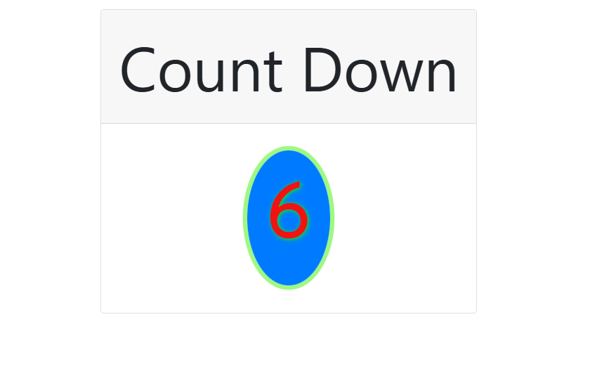
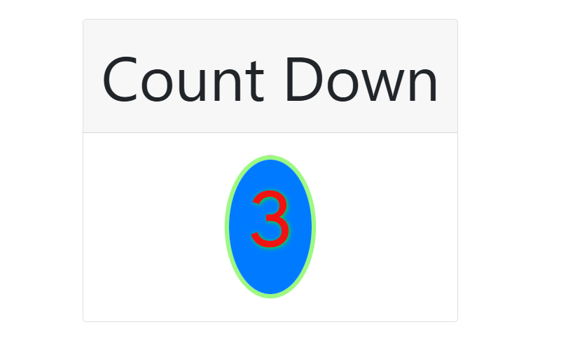

# ⏳ callback-hell(Countdown Project)

A simple project demonstrating **Callback Hell in JavaScript** using a countdown timer.  
The project displays a countdown from 10 to 0 using nested `setTimeout()` functions and finally shows a **Happy Independence Day** message with an image.

---

## ✨ Features
- Countdown timer from **10 to 0**.
- Uses **nested callbacks** (callback hell pattern).
- Displays a festive **Independence Day message** with an image after countdown.
- Styled with **Bootstrap** and **custom CSS**.
- Responsive design.

---

## 📂 Project Structure
callback-hell/
│── index.html # Main HTML file
│── style.css # Custom styles
│── script.js # Countdown logic with setTimeout()

---


## 🔽 Clone the Repository
```bash
git clone https://github.com/Elanthiran/callback-hell.git
cd callback-hell
```

---

## ▶️ Usage

1. Open index.html in your browser.

2. Watch the countdown start from 10.

3. After reaching 0, the Independence Day message and image will be displayed.
 ---
 
## 📸 Screenshots

Countdown Timer :




Independence Day Message


---

## 🛠 Tech Stack

- HTML5 – Page structure

- CSS3 – Styling

- Bootstrap  – Layout & responsiveness

- JavaScript (Vanilla JS) – Countdown logic with callback hell

  ---

## 🚀 Future Improvements

- Refactor code using Promises or Async/Await to avoid callback hell.

- Add animations to the countdown.

- Allow user to set a custom countdown timer.

- Add sound effects when countdown finishes.

  ---

## 🤝 Contributing

Contributions are welcome!

- Fork & clone repo


- Create a feature branch


- Commit changes


- Push branch

---

📜 License

This project is licensed under the MIT License – feel free to use it for learning and personal projects.


